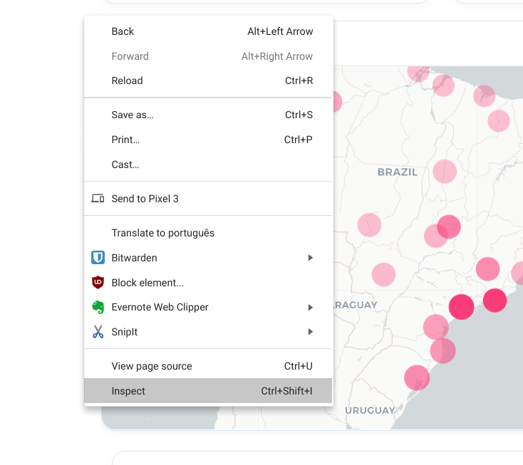
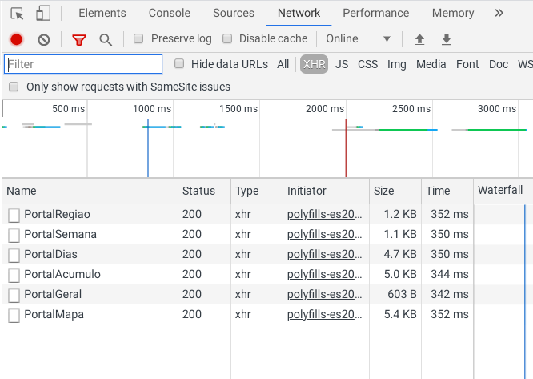
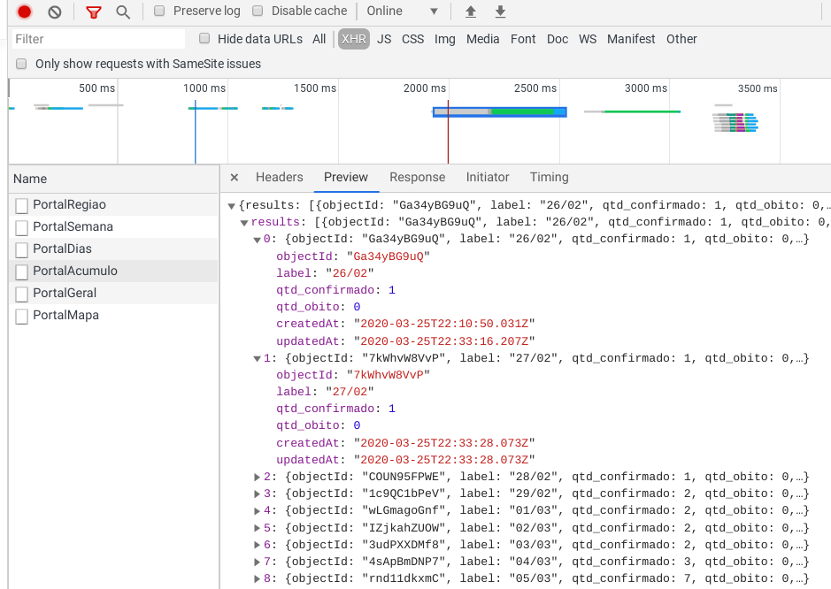
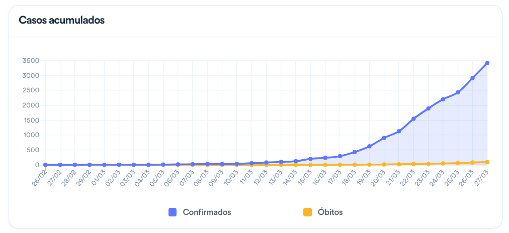
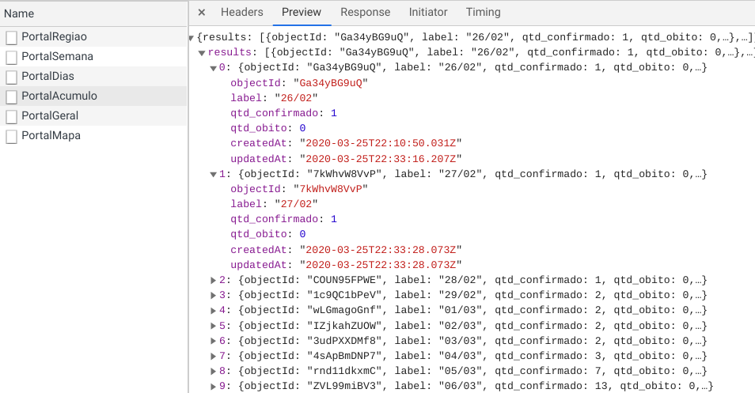
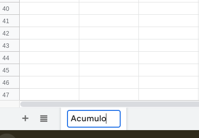
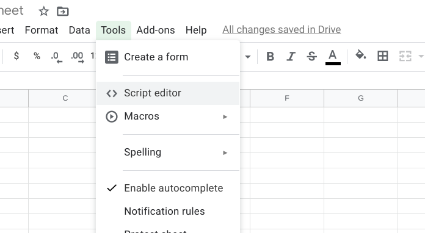
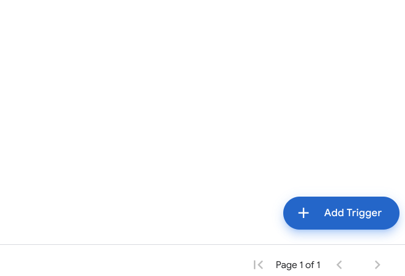
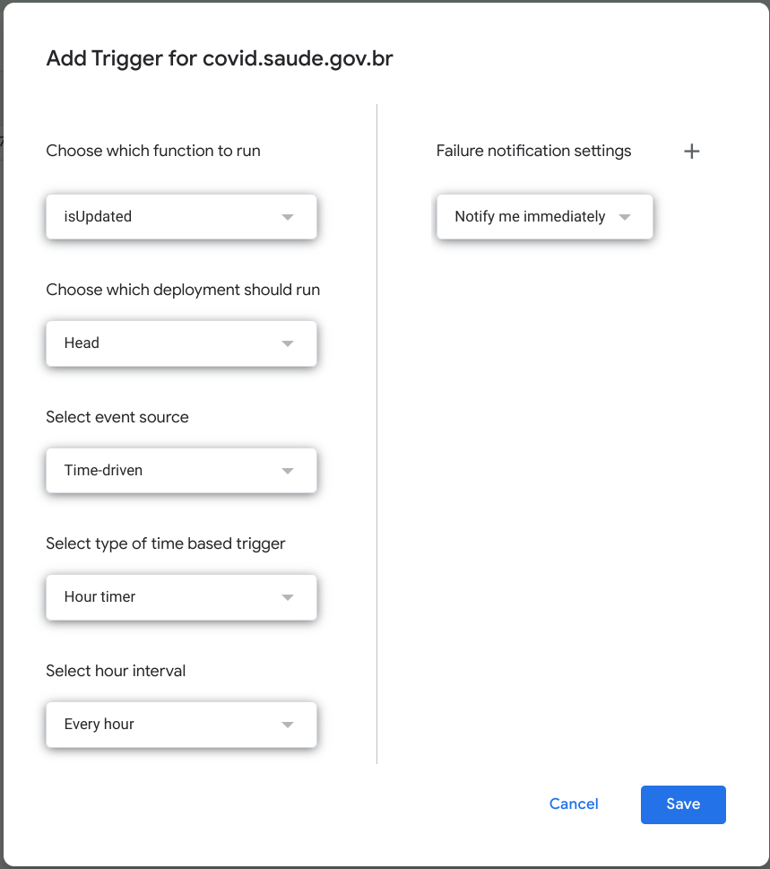

# covid-br-sheets
Uma [planilha Google](https://docs.google.com/spreadsheets/d/1vSxIPmqUbYTyLLM4eNddfU6CT2loAcWVQ0NX-gItceU/edit#gid=0) que raspa e armazena os dados em [covid.saude.gov.br](https://covid.saude.gov.br).

O governo brasileiro lançou um painel de controle com os dados sobre a COVID-19 no Brasil no dia 26 de março. Infelizmente, não existia uma opção para baixar os dados brutos. Esse projeto corrige essa falha.

Para acessar a planilha [clique aqui](https://docs.google.com/spreadsheets/d/1vSxIPmqUbYTyLLM4eNddfU6CT2loAcWVQ0NX-gItceU/edit#gid=0). Os dados são atualizados assim que uma alteração é feita no site do Ministério da Saúde.

Para acessar o script que alimenta a planilha você deve fazer uma cópia (`Arquivo -> Fazer cópia`) e acessar o editor de scripts (`Ferramentas -> Editor de script`).

## Como fazer

### Estratégia
Um resumo do que queremos fazer:
 - Bolar uma requisição de dados para covid.saude.gov.br a partir do **Google Sheets**
 - Baixar os dados e prepará-los para manipulá-los no **Google Sheets**
 - Transformar cada registro em linha e coluna 
 - Copiar os dados para a planilha 
 - Verificar a cada hora se os dados no site do **Ministério da Saúde** foram atualizados e atualizar a planilha caso necessário
 - Fazer tudo isso automaticamente

### Onde estão os dados?
Acesse covid.saude.gov.br e abra as ferramentas de desenvolvedor. Qualquer navegador moderno possui opções parecidas. Para esse projeto, eu usei as do [Chrome](https://www.google.com/chrome/). Basta clicar com o botão direito em qualquer parte do site e escolher "`inspecionar`".



Clique na aba "`Network`" e recarregue o site (`ctrl + r` ou `command + r`). Selecione o filtro `XHR` (`XMLHttpRequest`). Esse filtro mostra as *requisições de dados* entre seu navegador e o servidor do site. Existem seis requisições e todas são relacionadas ao painel sobre a COVID-19 no Brasil. Os dados são transferidos no formato [`JSON`](https://pt.wikipedia.org/wiki/JSON):



Uma das coisas mais legais das ferramentas de desenvolvedor é que você pode gerar o comando que faz cada requisição de dados com muita facilidade. Com esse comando, vamos montar um script que baixa os dados e converter cada [string](https://pt.wikipedia.org/wiki/Cadeia_de_caracteres) `JSON` em linhas e colunas.

Por exemplo, clique em `PortalAcumulo` e depois na aba "`Preview`". É possível visualizar os dados que alimentam a visualização "`Casos acumulados`":


Os dados que estão aqui...


...alimentam essa visualização.

É possível entender um pouco a estrutura dos dados da requisição `PortalAcumulo`.  Há 30 registros e vamos transformá-los em linhas na nossa planilha. Cada registro possui um grupo de marcadores que serão nossas colunas: `label` (vamos renomear para `data` na planilha), `qtd_confirmado`, `qtd_obito`, `createdAt`, `updatedAt`.  Vamos ignorar `objectId`. O mesmo vale para as outras requisições com algumas pequenas alterações dependendo do caso.



Clique com o botão direito em `PortalAcumulo` e selecione `Copy -> Copy as fetch`. Você terá na sua área de transferência:

```javascript
    fetch("https://xx9p7hp1p7.execute-api.us-east-1.amazonaws.com/prod/PortalAcumulo", {
    "credentials":"omit",
    "headers":{
    "accept":"application/json, text/plain, */*",
    "accept-language":"pt-BR,pt;q=0.9,en-US;q=0.8,en;q=0.7",
    "sec-fetch-dest":"empty",
    "sec-fetch-mode":"cors",
    "sec-fetch-site":"cross-site",
    "x-parse-application-id":"unAFkcaNDeXajurGB7LChj8SgQYS2ptm"
    },
    "referrer":"https://covid.saude.gov.br/",
    "referrerPolicy":"no-referrer-when-downgrade",
    "body":null,
    "method":"GET",
    "mode":"cors"
    });
```
Esse comando usa uma função javascript (`fetch`) para baixar os dados de cada requisição. É possível carregar essa função no Google Sheets para baixar os dados. Você pode aprender um pouco mais sobre o assunto lendo sobre o [protocolo HTTP](https://developer.mozilla.org/en-US/docs/Web/HTTP/Basics_of_HTTP). O processo é semelhante em cada etapa, então vamos focar em uma requisição e o mesmo princípio pode ser aplicado nas outras. **Guarde esse comando**, vamos precisar dele mais tarde.

 ### Google Sheets
 Crie uma planilha em branco no **Google Sheets** (basta digitar [`sheet.new`](https://sheet.new) no navegador). Você vai precisar de uma conta Google (corporativa ou pessoal). Caso prefira, basta criar uma para esse projeto.

Com a planilha em branco, vamos renomear a pasta para `Acumulo`. 



#### Criando um script

Nos bastidores do **Google Sheets** é possível adicionar scripts de programação para deixar a planilha ainda mais poderosa. A vantagem de usar o editor de scripts do **Google** é que você vai poder usar toda a infraestrutura de nuvem da empresa para rodar os projetos gratuitamente. 

As conveniências são muitas: armazenamento de arquivos, versionamento, um debugger para investigar erros, um sistema de tarefas agendadas para executar seu script automaticamente, e uma série de bibliotecas que integram outros serviços do Google. Isso tudo sem sair do navegador. 

A desvantagem de usar o editor de scripts do **Google** é que você vai precisar programar numa linguagem específica, chamada **[Apps Script](https://developers.google.com/apps-script)**, que é basicamente um javascript mais vitaminado. Outra desvantagem é que você terá menos controle sobre a integração dos recursos e sobre o disparo das tarefas agendadas. Contudo, é possível conectar o **Google Sheets** com outras linguagens de programação, como [`Python`](https://developers.google.com/sheets/api/quickstart/python), [`Ruby`](https://developers.google.com/sheets/api/quickstart/ruby), [`PHP`](https://developers.google.com/sheets/api/quickstart/php) e [`Go`](https://developers.google.com/sheets/api/quickstart/go).

Clique em `Ferramentas` -> `Editor de script`. 



Apague o que estiver no editor e copie o conteúdo do arquivo [scraper.gs](https://github.com/mtrpires/covid-br-sheets/blob/master/scraper.gs) para o seu editor se você estiver criando uma planilha em branco. Se você fizer uma cópia da planilha original, o script será copiado também e estará lá assim que você abrir o editor a partir do arquivo copiado. Tente navegar pelo arquivo e pelos comentários para compreender o que cada bloco de código faz. Essa é uma boa hora para salvar seu projeto (`Arquivo` -> `Salvar`).


#### Agendar a execução do script
Clique no ícone do relógio na barra de ferramentas. Na nova aba, clique no botão azul no canto inferior direito para adicionar uma nova tarefa. 



Vamos executar a função `isUpdated`uma vez por hora. Você também pode receber avisos por email caso a execução falhe. Clique em salvar



Pronto! Você pode fechar a planilha, desligar o computador e fazer outras coisas. O serviço vai executar o script automaticamente de hora em hora e executar as ações necessárias.
